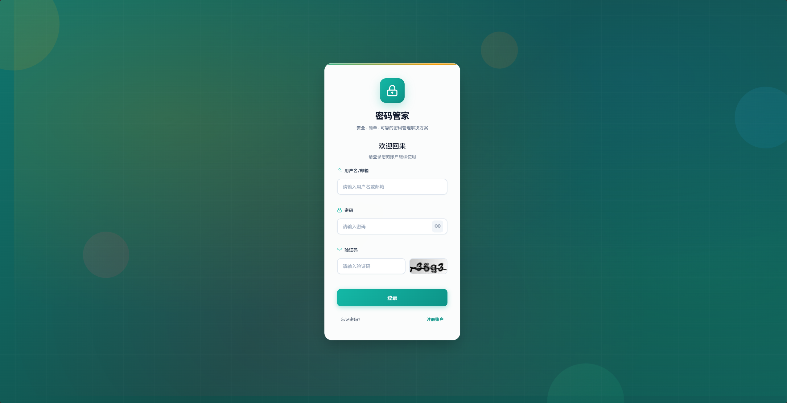
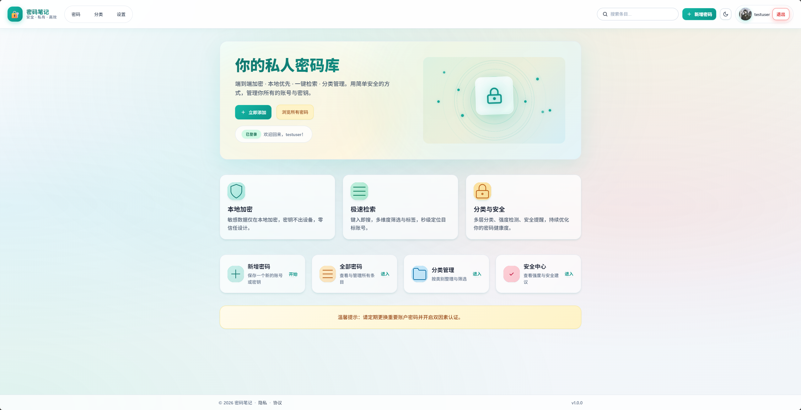
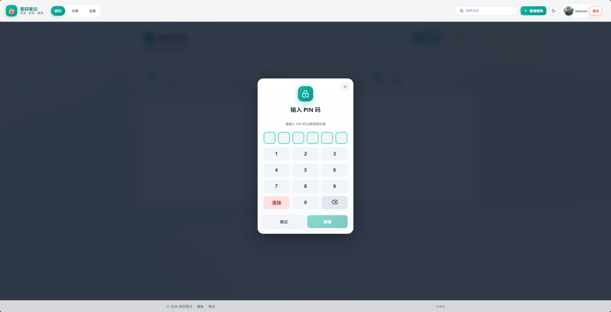
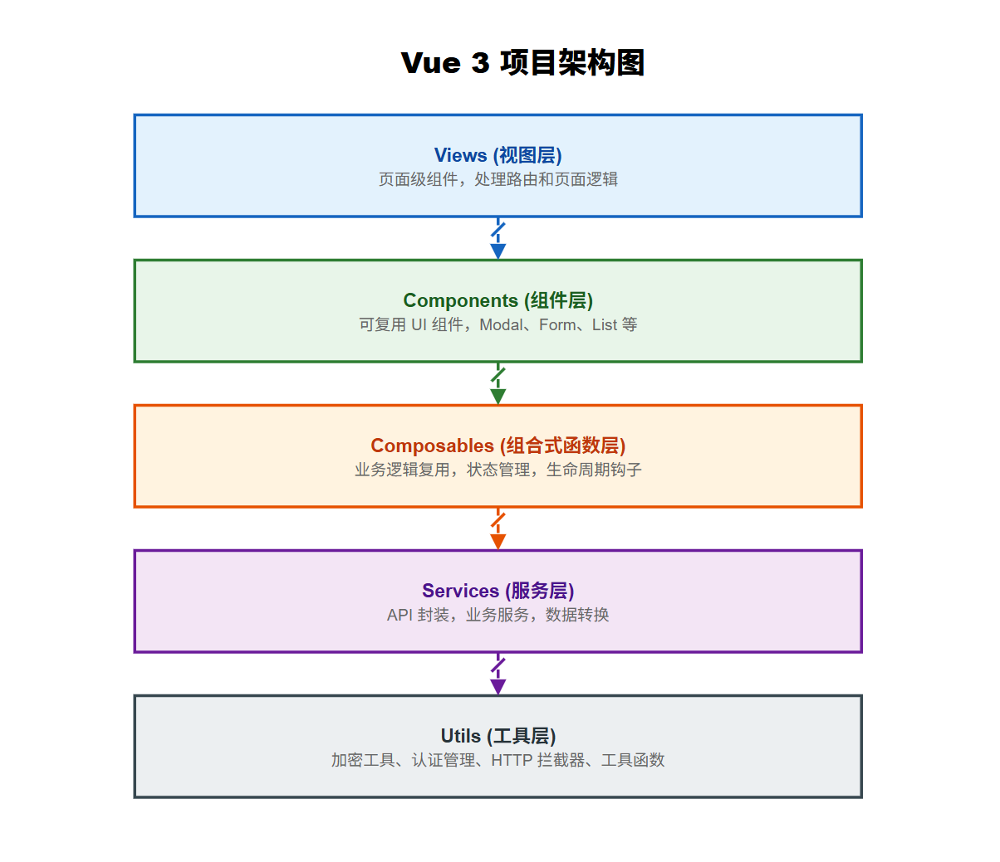
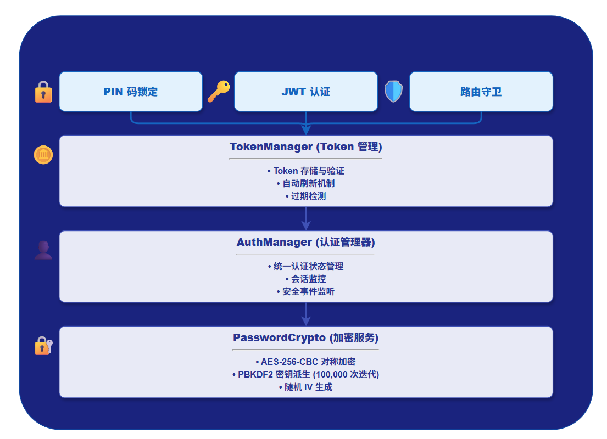
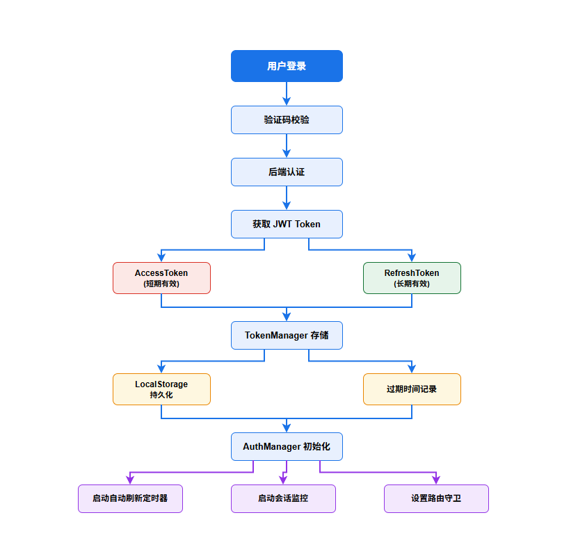
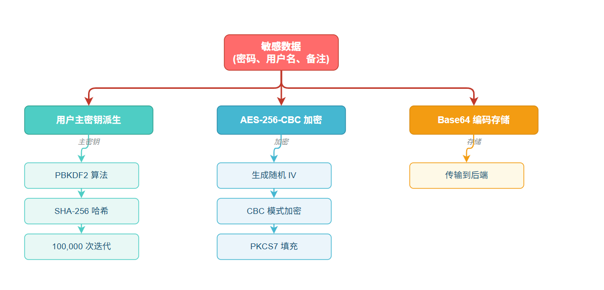

# 🔐 Password Note - 安全密码管理器

<div align="center">


**一个基于 Vue 3 + TypeScript 构建的现代化、安全的密码管理应用**

[功能特性](#功能特性) • [界面展示](#界面展示) • [技术架构](#技术架构) • [相关项目](#相关项目) • [快速开始](#快速开始)

</div>

***

## 📖 项目简介

Password Note 是一个注重安全性和用户体验的密码管理应用。采用前后端分离架构，前端使用 Vue 3 Composition API 和 TypeScript 构建，实现了企业级的安全认证机制和数据加密方案。

> 🎯 **这是一个完整的前后端分离项目**
> - 📦 **前端项目**（当前仓库）：Vue 3 + TypeScript + Pinia
> - 🔗 **后端项目**：[password_note_server](https://github.com/TopGGboy/password_note_server) - Spring Boot 3 + MyBatis Plus + MySQL + Redis

### 🎯 设计理念

- **安全优先**: 采用 AES-256-CBC 加密算法，多层安全防护机制
- **架构清晰**: 分层架构设计，职责分离，易于维护和扩展
- **用户体验**: 响应式设计，流畅的交互体验，完善的状态管理
- **工程化**: TypeScript 强类型约束，模块化开发，代码质量保障

***

## 📸 界面展示

### 登录界面



### 主界面



### PIN 码锁定



***

## ✨ 功能特性

### 核心功能

- 🔑 **密码管理** - 密码条目的增删改查、分类管理、收藏标记
- 🔍 **智能搜索** - 关键词搜索、分类筛选、多维度排序
- 📂 **分类系统** - 自定义分类、颜色标记、图标选择
- ⭐ **收藏功能** - 快速收藏、收藏列表管理
- 📊 **使用统计** - 使用次数记录、最后使用时间追踪

### 安全特性

- 🛡️ **JWT 认证** - 基于 Token 的无状态认证机制
- 🔄 **Token 自动刷新** - 无感知的 Token 续期机制
- 🔒 **PIN 码锁定** - 应用级 PIN 码保护，会话超时管理
- 🔐 **前端加密** - AES-256-CBC + PBKDF2 密钥派生
- 🚨 **会话监控** - 实时会话状态监控，异常登出处理
- 🎫 **验证码验证** - 图形验证码防护机制

### 用户体验

- 🎨 **响应式设计** - 适配多种屏幕尺寸
- 🌙 **现代 UI** - 简洁美观的用户界面
- ⚡ **性能优化** - 路由懒加载、分页加载、虚拟滚动
- 🔔 **消息通知** - 友好的操作反馈和错误提示
- 📱 **密码生成器** - 可配置的强密码生成工具
- 📥 **数据导入导出** - 支持数据备份和恢复

***

## 🏗️ 技术架构

### 技术栈

| 类别           | 技术         | 版本   | 说明                      |
| ------------ | ---------- | ---- | ----------------------- |
| **核心框架**     | Vue.js     | 3.2  | 渐进式 JavaScript 框架       |
| **开发语言**     | TypeScript | 4.5  | JavaScript 的超集，提供静态类型检查 |
| **状态管理**     | Pinia      | 3.0  | Vue 3 官方推荐的状态管理库        |
| **路由管理**     | Vue Router | 4.0  | Vue.js 官方路由管理器          |
| **HTTP 客户端** | Axios      | 1.11 | 基于 Promise 的 HTTP 客户端   |
| **加密库**      | CryptoJS   | 4.1  | JavaScript 加密库          |
| **构建工具**     | Vue CLI    | 5.0  | Vue.js 标准构建工具链          |
| **容器化**      | Docker     | -    | 应用容器化部署                 |

### 架构设计

#### 1. 分层架构



#### 2. 安全架构




#### 3. 认证流程



#### 4. 数据加密流程



### 核心设计模式

#### 1. 单例模式 (Singleton)

用于全局唯一的管理器实例：

```typescript
// AuthManager - 认证管理器
export class AuthManager {
  private static instance: AuthManager
  
  public static getInstance(): AuthManager {
    if (!AuthManager.instance) {
      AuthManager.instance = new AuthManager()
    }
    return AuthManager.instance
  }
}

// TokenManager - Token 管理器
// PinManager - PIN 码管理器
```

#### 2. 组合模式 (Composition)

使用 Vue 3 Composition API 实现逻辑复用：

```typescript
// useAuth - 认证状态管理
export function useAuth() {
  const isAuthenticated = ref(false)
  const currentUser = ref<any>(null)
  
  const login = async (token: string, refreshToken?: string) => {
    // 登录逻辑
  }
  
  return {
    isAuthenticated,
    currentUser,
    login
  }
}

// usePasswordEntries - 密码条目管理
// useCategories - 分类管理
// usePinLock - PIN 锁定管理
```

#### 3. 观察者模式 (Observer)

事件监听和状态同步：

```typescript
// 安全事件监听器
export class SecurityEventListener {
  private static listeners: Map<string, Function[]> = new Map()
  
  static addEventListener(event: string, callback: Function) {
    // 添加事件监听
  }
  
  static dispatchEvent(event: string, data?: any) {
    // 触发事件
  }
}

// 多标签页同步
window.addEventListener('storage', (e) => {
  if (e.key === STORAGE_KEYS.ACCESS_TOKEN) {
    // Token 变化同步
  }
})
```

#### 4. 策略模式 (Strategy)

加密算法的可扩展设计：

```typescript
export class PasswordCrypto {
  private static readonly ALGORITHM = "AES"
  private static readonly MODE = CryptoJS.mode.CBC
  private static readonly PADDING = CryptoJS.pad.Pkcs7
  
  static encrypt(plaintext: string, key: WordArray): string {
    // 加密策略
  }
  
  static decrypt(ciphertext: string, key: WordArray): string {
    // 解密策略
  }
}
```

***

## 🚀 快速开始

### 环境要求

- Node.js >= 14.0.0
- npm >= 6.0.0 或 yarn >= 1.22.0

### 安装依赖

```bash
# 克隆项目
git clone https://github.com/yourusername/password-note.git

# 进入项目目录
cd password-note

# 安装依赖
npm install
```

### 开发运行

```bash
# 启动开发服务器
npm run serve

# 访问 http://localhost:3000
```

### 生产构建

```bash
# 构建生产版本
npm run build
```

### Docker 部署

```bash
# 构建镜像
docker build -t password-note .

# 运行容器
docker run -d -p 80:80 password-note

# 或使用 docker-compose
docker-compose up -d
```

***

## 📁 项目结构

```
password-note/
├── public/                     # 静态资源
│   ├── favicon.ico
│   └── index.html
├── src/                        # 源代码
│   ├── assets/                 # 资源文件
│   ├── components/             # 组件
│   │   ├── common/            # 通用组件
│   │   │   ├── AppLayout.vue          # 应用布局
│   │   │   ├── CategorySelector.vue   # 分类选择器
│   │   │   ├── ConfirmDialog.vue      # 确认对话框
│   │   │   ├── LockedOverlay.vue      # 锁定遮罩
│   │   │   └── Notification.vue       # 通知组件
│   │   ├── modals/            # 模态框组件
│   │   │   ├── AddPasswordModal.vue       # 添加密码
│   │   │   ├── ChangePasswordModal.vue    # 修改密码
│   │   │   ├── DeleteAccountModal.vue     # 删除账户
│   │   │   ├── EditPasswordModal.vue      # 编辑密码
│   │   │   ├── ImportDataModal.vue        # 导入数据
│   │   │   ├── PasswordGeneratorModal.vue # 密码生成器
│   │   │   ├── PinModal.vue               # PIN 验证
│   │   │   ├── PinSettingsModal.vue       # PIN 设置
│   │   │   ├── SearchModal.vue            # 搜索模态框
│   │   │   └── SessionsModal.vue          # 会话管理
│   │   └── password/          # 密码相关组件
│   │       ├── PasswordEntriesList.vue    # 密码列表
│   │       └── PasswordEntryDetail.vue    # 密码详情
│   ├── composables/           # 组合式函数
│   │   ├── useAuth.ts                # 认证管理
│   │   ├── useCategories.ts          # 分类管理
│   │   ├── useNotification.ts        # 通知管理
│   │   ├── usePasswordEntries.ts     # 密码条目管理
│   │   └── usePinLock.ts             # PIN 锁管理
│   ├── config/                # 配置文件
│   │   └── auth.config.ts            # 认证配置
│   ├── constants/             # 常量定义
│   │   ├── constants.ts              # 常量
│   │   └── index.ts                  # 导出
│   ├── router/                # 路由配置
│   │   └── index.ts                  # 路由定义
│   ├── services/              # 服务层
│   │   ├── api/                      # API 接口
│   │   │   ├── captcha.ts           # 验证码接口
│   │   │   ├── categories.ts        # 分类接口
│   │   │   ├── email.ts             # 邮件接口
│   │   │   ├── passwordEntries.ts   # 密码条目接口
│   │   │   └── user.ts              # 用户接口
│   │   └── api.ts                    # API 统一导出
│   ├── store/                 # 状态管理
│   │   ├── auth.ts                   # 认证状态
│   │   └── index.ts                  # Store 导出
│   ├── styles/                # 样式文件
│   │   └── theme.css                 # 主题样式
│   ├── types/                 # 类型定义
│   │   ├── api.ts                    # API 类型
│   │   ├── pinia.d.ts               # Pinia 类型
│   │   └── vue.d.ts                 # Vue 类型
│   ├── utils/                 # 工具函数
│   │   ├── auth/                     # 认证相关
│   │   │   ├── authManager.ts       # 认证管理器
│   │   │   ├── pinManager.ts        # PIN 管理器
│   │   │   ├── security.ts          # 安全工具
│   │   │   └── tokenManager.ts      # Token 管理器
│   │   ├── encryption/               # 加密相关
│   │   │   ├── crypto.ts            # 加密工具
│   │   │   └── index.ts             # 导出
│   │   ├── appInit.ts               # 应用初始化
│   │   ├── categoryUtils.ts         # 分类工具
│   │   ├── dateUtils.ts             # 日期工具
│   │   ├── http.ts                  # HTTP 客户端
│   │   ├── logger.ts                # 日志工具
│   │   └── toast.ts                 # 提示工具
│   ├── views/                 # 页面视图
│   │   ├── auth/                     # 认证页面
│   │   │   ├── Login.vue            # 登录页
│   │   │   ├── Register.vue         # 注册页
│   │   │   └── ResetPassword.vue    # 重置密码页
│   │   ├── dashboard/                # 控制台页面
│   │   │   ├── Dashboard.vue        # 主控制台
│   │   │   └── Settings.vue         # 设置页
│   │   └── password/                 # 密码页面
│   │       ├── Categories.vue       # 分类管理
│   │       ├── PasswordDetail.vue   # 密码详情
│   │       └── Passwords.vue        # 密码列表
│   ├── App.vue                        # 根组件
│   └── main.ts                        # 入口文件
├── .browserslistrc                    # 浏览器兼容配置
├── .env.development                   # 开发环境变量
├── .env.production                    # 生产环境变量
├── .gitignore                         # Git 忽略配置
├── Dockerfile                         # Docker 配置
├── docker-compose.yml                 # Docker Compose 配置
├── nginx.conf                         # Nginx 配置
├── package.json                       # 项目依赖
├── tsconfig.json                      # TypeScript 配置
└── vue.config.js                      # Vue CLI 配置
```

***

## 🔧 核心模块详解

### 1. 认证模块 (Authentication)

**文件**: `src/utils/auth/authManager.ts`

**功能**:

- 统一的认证状态管理
- JWT Token 自动刷新
- 会话监控和超时处理
- 多标签页状态同步
- 安全事件监听

**关键实现**:

```typescript
// Token 自动刷新机制
private startAutoRefresh(): void {
  setInterval(async () => {
    if (this.isAuthenticated() && this.tokenManager.isTokenExpiringSoon()) {
      await this.refreshToken()
    }
  }, 60000) // 每分钟检查一次
}

// 会话监控
private startSessionMonitoring(): void {
  SecurityUtils.startSessionMonitoring(
    () => { /* 会话即将过期警告 */ },
    () => { this.logout('会话超时') }
  )
}
```

### 2. 加密模块 (Encryption)

**文件**: `src/utils/encryption/crypto.ts`

**功能**:

- AES-256-CBC 对称加密
- PBKDF2 密钥派生 (100,000 次迭代)
- 随机 IV 生成
- 密码条目加密/解密

**加密流程**:

```typescript
// 密钥派生
static generateKey(password: string, salt: string): WordArray {
  return CryptoJS.PBKDF2(password, salt, {
    keySize: 256 / 32,
    iterations: 100000,
    hasher: CryptoJS.algo.SHA256
  })
}

// 加密
static encrypt(plaintext: string, key: WordArray): string {
  const iv = this.generateIV()
  const encrypted = CryptoJS.AES.encrypt(plaintext, key, {
    iv: iv,
    mode: CryptoJS.mode.CBC,
    padding: CryptoJS.pad.Pkcs7
  })
  return iv.concat(encrypted.ciphertext).toString(CryptoJS.enc.Base64)
}
```

### 3. HTTP 拦截器 (HTTP Interceptor)

**文件**: `src/utils/http.ts`

**功能**:

- 请求拦截：自动添加 Token
- 响应拦截：统一错误处理
- Token 过期自动刷新
- 请求重试机制

**关键实现**:

```typescript
// 请求拦截器
http.interceptors.request.use(async (config) => {
  if (!isPublicEndpoint(config.url)) {
    const token = tokenManager.getAccessToken()
    if (token && !tokenManager.isTokenExpired()) {
      config.headers.Authorization = `Bearer ${token}`
    } else if (tokenManager.isTokenExpired()) {
      // Token 过期，自动刷新
      const newToken = await tokenManager.refreshToken()
      config.headers.Authorization = `Bearer ${newToken}`
    }
  }
  return config
})

// 响应拦截器
http.interceptors.response.use(
  (response) => {
    // 检查响应头中的新 Token
    const newToken = response.headers['x-new-token']
    if (newToken) {
      tokenManager.setTokens(newToken)
    }
    return response.data
  },
  async (error) => {
    if (error.response?.status === 401) {
      // 处理 401 错误
      await handleUnauthorizedError(error.config, error)
    }
    return Promise.reject(error)
  }
)
```

### 4. 路由守卫 (Route Guard)

**文件**: `src/router/index.ts`

**功能**:

- 认证状态检查
- 路由权限验证
- 页面标题设置
- 登录状态重定向

**关键实现**:

```typescript
router.beforeEach(async (to, from, next) => {
  // 设置页面标题
  document.title = to.meta?.title || '密码笔记'
  
  // 初始化认证管理器
  if (!authManager['isInitialized']) {
    await authManager.initialize()
  }
  
  // 检查路由访问权限
  const requiresAuth = to.matched.some(record => record.meta?.requiresAuth)
  
  if (requiresAuth && !authManager.isAuthenticated()) {
    next(ROUTES.LOGIN)
  } else if (!requiresAuth && authManager.isAuthenticated()) {
    if (to.path === ROUTES.LOGIN || to.path === ROUTES.REGISTER) {
      next(ROUTES.HOME)
    } else {
      next()
    }
  } else {
    next()
  }
})
```

### 5. PIN 码锁定 (PIN Lock)

**文件**: `src/utils/auth/pinManager.ts`

**功能**:

- PIN 码设置和验证
- 会话管理
- 超时自动锁定
- 用户切换处理

**关键实现**:

```typescript
export class PinManager {
  private static readonly SESSION_DURATION = 30 * 60 * 1000 // 30 分钟
  
  verifyPin(pin: string): boolean {
    const storedHash = localStorage.getItem(this.getPinHashKey())
    const salt = localStorage.getItem(this.getPinSaltKey())
    const computedHash = this.hashPin(pin, salt)
    
    if (computedHash === storedHash) {
      this.setVerified() // 设置会话验证状态
      return true
    }
    return false
  }
  
  isVerified(): boolean {
    const expiry = sessionStorage.getItem(this.getSessionExpiryKey())
    if (Date.now() > parseInt(expiry)) {
      this.clearVerification() // 超时清除验证状态
      return false
    }
    return true
  }
}
```

***

## 🎯 技术亮点

### 1. 企业级安全方案

- ✅ **多层安全防护**: PIN 锁 → JWT 认证 → 路由守卫 → 数据加密
- ✅ **无感知 Token 刷新**: 用户无需重新登录即可续期会话
- ✅ **端到端加密**: 敏感数据在前端加密，后端只存储密文
- ✅ **会话管理**: 自动超时、多标签页同步、异常登出处理

### 2. 架构设计

- ✅ **分层架构**: 视图层、组件层、业务层、服务层、工具层职责清晰
- ✅ **模块化设计**: 高内聚低耦合，易于维护和扩展
- ✅ **类型安全**: TypeScript 强类型约束，减少运行时错误
- ✅ **代码复用**: Composables 实现逻辑复用，避免代码冗余

### 3. 性能优化

- ✅ **路由懒加载**: 按需加载页面组件，减少首屏加载时间
- ✅ **分页加载**: 大数据量分页查询，避免一次性加载
- ✅ **虚拟滚动**: 长列表性能优化
- ✅ **防抖节流**: 搜索输入、滚动事件优化

### 4. 开发体验

- ✅ **热重载**: 开发环境实时预览
- ✅ **代码规范**: ESLint + TypeScript 规范约束
- ✅ **完善的类型提示**: IDE 智能提示和类型检查
- ✅ **模块化样式**: CSS 作用域隔离，主题定制

***

## 📊 性能指标

| 指标       | 数值      | 说明        |
| -------- | ------- | --------- |
| 首屏加载时间   | < 2s    | 路由懒加载优化   |
| 打包体积     | < 500KB | Gzip 压缩后  |
| 加密性能     | < 50ms  | 单次加密/解密耗时 |
| Token 刷新 | < 200ms | 无感知刷新     |

***

## 🔐 安全最佳实践

### 1. 密码存储

- ✅ 使用 PBKDF2 算法派生密钥，迭代次数 100,000 次
- ✅ 每次加密生成随机 Salt 和 IV
- ✅ 敏感数据加密后再传输到后端

### 2. Token 管理

- ✅ AccessToken 短期有效（如 15 分钟）
- ✅ RefreshToken 长期有效（如 7 天）
- ✅ Token 存储在 LocalStorage，刷新时更新
- ✅ 自动检测 Token 过期并刷新

### 3. 会话安全

- ✅ 会话超时自动登出
- ✅ 多标签页状态同步
- ✅ 页面可见性变化时检查认证状态
- ✅ 用户活动时间追踪

### 4. 前端防护

- ✅ XSS 防护：Vue 自动转义
- ✅ CSRF 防护：Token 验证
- ✅ 路由守卫：未认证用户重定向
- ✅ 敏感数据不记录日志

***

## 🧪 测试

```bash
# 运行单元测试
npm run test:unit

# 运行端到端测试
npm run test:e2e

# 代码覆盖率报告
npm run test:coverage
```

***

## 👨‍💻 作者

**Your Name**

- GitHub: [@TopGGboy](https://github.com/TopGGboy)
- Email: topggboy\@163.com

***

## 🔗 相关项目

### 后端服务

本项目是一个完整的前后端分离应用，后端服务采用 Spring Boot 3 构建：

**[password_note_server](https://github.com/TopGGboy/password_note_server)**

#### 后端技术栈

| 技术 | 说明 |
|------|------|
| **Spring Boot 3.1.5** | 核心开发框架 |
| **Java 17** | LTS 版本 |
| **MyBatis Plus 3.5.3** | 持久层框架 |
| **MySQL 8.0** | 关系型数据库 |
| **Redis 7** | 缓存和会话管理 |
| **Spring Security** | 安全框架 |
| **JWT** | 双 Token 认证机制 |
| **MinIO** | 对象存储服务 |

#### 后端特性

- 🔐 **双 Token 机制** - Access Token + Refresh Token
- 🛡️ **BCrypt 加密** - 密码加盐哈希加密
- 🚫 **登录失败锁定** - 连续失败 5 次锁定账户 30 分钟
- 🔒 **Token 黑名单** - 支持主动登出与 Token 失效
- 📊 **数据隔离** - 用户只能访问自己的密码数据
- 🎫 **图形验证码** - 防止暴力破解

***

## 🙏 致谢

感谢以下开源项目：

- [Vue.js](https://vuejs.org/)
- [TypeScript](https://www.typescriptlang.org/)
- [Pinia](https://pinia.vuejs.org/)
- [CryptoJS](https://github.com/brix/crypto-js)
- [Axios](https://axios-http.com/)

***

<div align="center">

**⭐ 如果这个项目对你有帮助，请给一个 Star ⭐**

Made with ❤️ by Your Name

</div>
