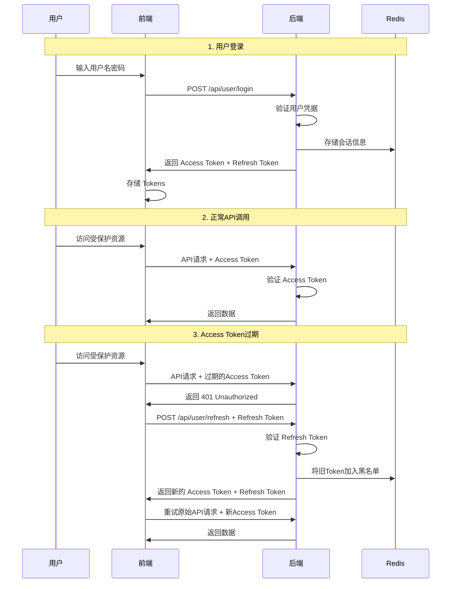

# JWT Token 机制详解

## 概述

在现代Web应用的认证系统中，通常使用两种Token：**访问Token（Access Token）**和**刷新Token（Refresh Token）**。这种双Token机制提供了安全性和用户体验的最佳平衡。

## 1. 访问Token（Access Token）

### 🎯 **作用和用途**

访问Token是用户访问受保护资源的**通行证**，类似于临时身份证。

- **主要用途**：携带在每个API请求中，证明用户身份
- **验证资源**：用于访问用户数据、执行业务操作
- **权限控制**：包含用户权限信息，控制访问范围

### ⏰ **生命周期特点**

```
生命周期：短（通常15分钟 - 1小时）
使用频率：每个API请求都需要
存储位置：内存中（不持久化存储）
安全级别：高（频繁传输，容易被截获）
```

### 📋 **Token内容示例**

```json
{
  "sub": "12345",           // 用户ID
  "username": "john_doe",   // 用户名
  "email": "john@example.com", // 邮箱
  "type": "access",         // Token类型
  "iat": 1640995200,        // 签发时间
  "exp": 1640998800,        // 过期时间（1小时后）
  "jti": "uuid-access-123"  // Token唯一标识
}
```

### 🔒 **安全特性**

- ✅ **短期有效**：即使被盗用，影响时间有限
- ✅ **频繁更新**：定期刷新，降低风险
- ✅ **无敏感信息**：不包含密码等敏感数据
- ✅ **可撤销**：通过黑名单机制立即失效

## 2. 刷新Token（Refresh Token）

### 🎯 **作用和用途**

刷新Token是用于**获取新访问Token**的特殊凭证，类似于长期居住证。

- **主要用途**：当访问Token过期时，用于获取新的访问Token
- **避免重登录**：用户无需重新输入密码
- **长期认证**：维持用户的登录状态

### ⏰ **生命周期特点**

```
生命周期：长（通常7天 - 30天）
使用频率：仅在访问Token过期时使用
存储位置：安全存储（localStorage/安全Cookie）
安全级别：极高（长期有效，需严格保护）
```

### 📋 **Token内容示例**

```json
{
  "sub": "12345",           // 用户ID
  "type": "refresh",        // Token类型
  "iat": 1640995200,        // 签发时间
  "exp": 1641600000,        // 过期时间（7天后）
  "jti": "uuid-refresh-456" // Token唯一标识
}
```

### 🔒 **安全特性**

- ✅ **使用频率低**：减少网络传输风险
- ✅ **单次使用**：使用后立即失效，生成新的
- ✅ **严格验证**：需要额外的安全检查
- ✅ **可追踪**：记录使用历史，检测异常

## 3. 双Token工作流程

### 🔄 **完整认证流程**



### 🔧 **前端自动刷新机制**

```javascript
// 前端自动Token刷新逻辑
class TokenManager {
  async refreshTokenIfNeeded() {
    const token = this.getAccessToken()
    
    // 检查Token是否即将过期（提前5分钟刷新）
    if (this.isTokenExpiringSoon(token, 5 * 60 * 1000)) {
      try {
        const newTokens = await this.refreshToken()
        this.setTokens(newTokens.accessToken, newTokens.refreshToken)
        return newTokens.accessToken
      } catch (error) {
        // 刷新失败，跳转到登录页
        this.redirectToLogin()
        throw error
      }
    }
    
    return token
  }
}
```

## 4. 安全优势对比

### 📊 **单Token vs 双Token**

| 特性 | 单Token方案 | 双Token方案 |
|------|-------------|-------------|
| **安全性** | ⚠️ 中等 | ✅ 高 |
| **用户体验** | ⚠️ 需频繁登录 | ✅ 无感刷新 |
| **实现复杂度** | ✅ 简单 | ⚠️ 复杂 |
| **Token泄露风险** | ❌ 高（长期有效） | ✅ 低（短期+隔离） |
| **撤销能力** | ⚠️ 困难 | ✅ 灵活 |

### 🛡️ **安全防护机制**

1. **Token轮换（Token Rotation）**
   ```
   每次使用Refresh Token时：
   ├── 旧的Refresh Token立即失效
   ├── 生成新的Access Token
   └── 生成新的Refresh Token
   ```

2. **黑名单机制**
   ```
   Token失效场景：
   ├── 用户主动登出
   ├── 检测到异常使用
   ├── 管理员强制下线
   └── Token被盗用时紧急撤销
   ```

3. **异常检测**
   ```
   监控指标：
   ├── 同一Token多地使用
   ├── 异常时间段访问
   ├── 高频刷新请求
   └── 可疑IP地址
   ```

## 5. 实际应用场景

### 🌐 **Web应用场景**

```javascript
// 场景1：用户正常使用（Access Token有效）
fetch('/api/user/profile', {
  headers: {
    'Authorization': `Bearer ${accessToken}`
  }
})

// 场景2：Access Token过期，自动刷新
// HTTP拦截器自动处理：
// 1. 检测到401响应
// 2. 使用Refresh Token获取新Token
// 3. 重试原始请求
```

### 📱 **移动应用场景**

```javascript
// 移动应用的Token管理
class MobileTokenManager {
  constructor() {
    // 移动端通常使用更长的Token有效期
    this.accessTokenExpiry = 2 * 60 * 60 * 1000  // 2小时
    this.refreshTokenExpiry = 30 * 24 * 60 * 60 * 1000  // 30天
  }
  
  // 应用启动时检查Token状态
  async initializeAuth() {
    const refreshToken = await this.getStoredRefreshToken()
    if (refreshToken && !this.isTokenExpired(refreshToken)) {
      // 尝试刷新获取新的Access Token
      await this.refreshTokens()
    } else {
      // 需要重新登录
      this.redirectToLogin()
    }
  }
}
```

## 6. 最佳实践建议

### ✅ **推荐做法**

1. **Token有效期设置**
   ```
   Access Token:  15分钟 - 1小时
   Refresh Token: 7天 - 30天
   ```

2. **存储策略**
   ```
   Access Token:  内存存储（不持久化）
   Refresh Token: 安全存储（HttpOnly Cookie 或 安全的localStorage）
   ```

3. **刷新策略**
   ```
   提前刷新: Token过期前5分钟自动刷新
   失败处理: 刷新失败时立即跳转登录页
   ```

4. **安全措施**
   ```
   HTTPS传输: 所有Token传输必须使用HTTPS
   Token轮换: 每次刷新都生成新的Token对
   黑名单机制: 支持Token立即撤销
   异常监控: 监控Token使用异常
   ```

### ❌ **避免的做法**

1. **不要在URL中传递Token**
2. **不要使用过长的Access Token有效期**
3. **不要在不安全的地方存储Refresh Token**
4. **不要忽略Token的撤销机制**

## 7. 总结

### 🎯 **核心价值**

双Token机制通过**职责分离**实现了安全性和用户体验的平衡：

- **Access Token**：短期、高频使用、易于撤销
- **Refresh Token**：长期、低频使用、严格保护

### 🚀 **实际效果**

1. **用户体验**：无感知的自动登录状态维持
2. **安全保障**：即使Token泄露也能快速控制风险
3. **系统稳定**：减少因频繁登录导致的系统压力
4. **运维友好**：灵活的Token管理和撤销机制

这种机制已经成为现代Web应用认证系统的标准做法，被广泛应用于各种规模的应用中。