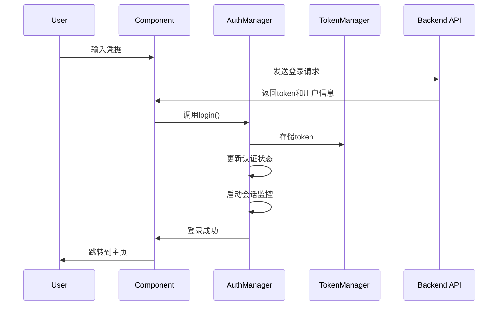
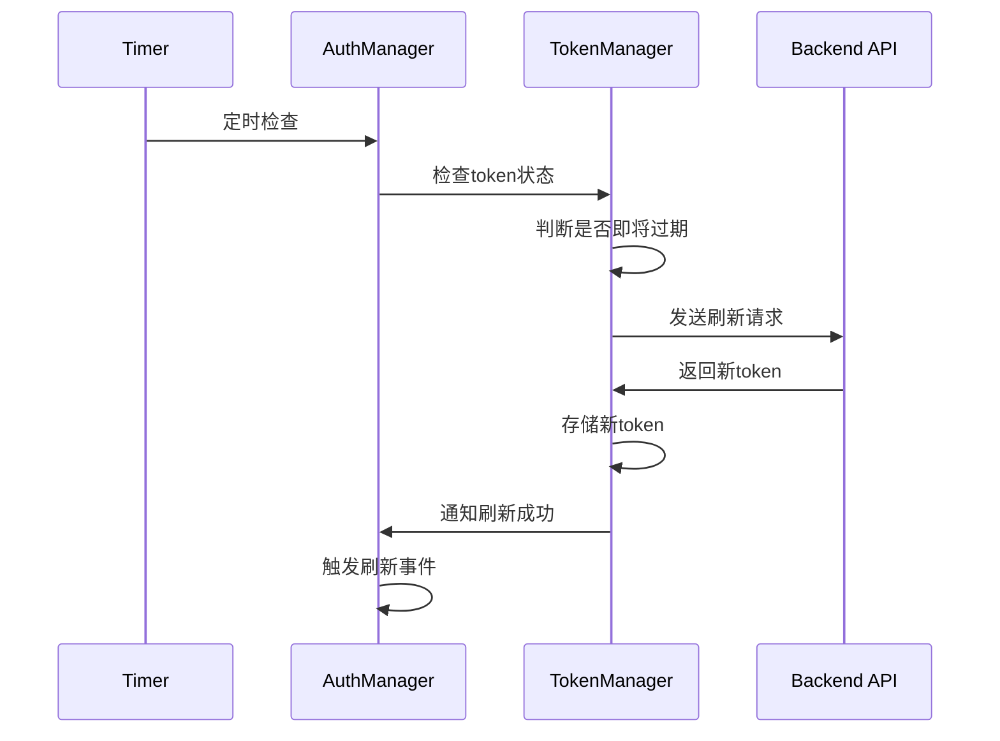
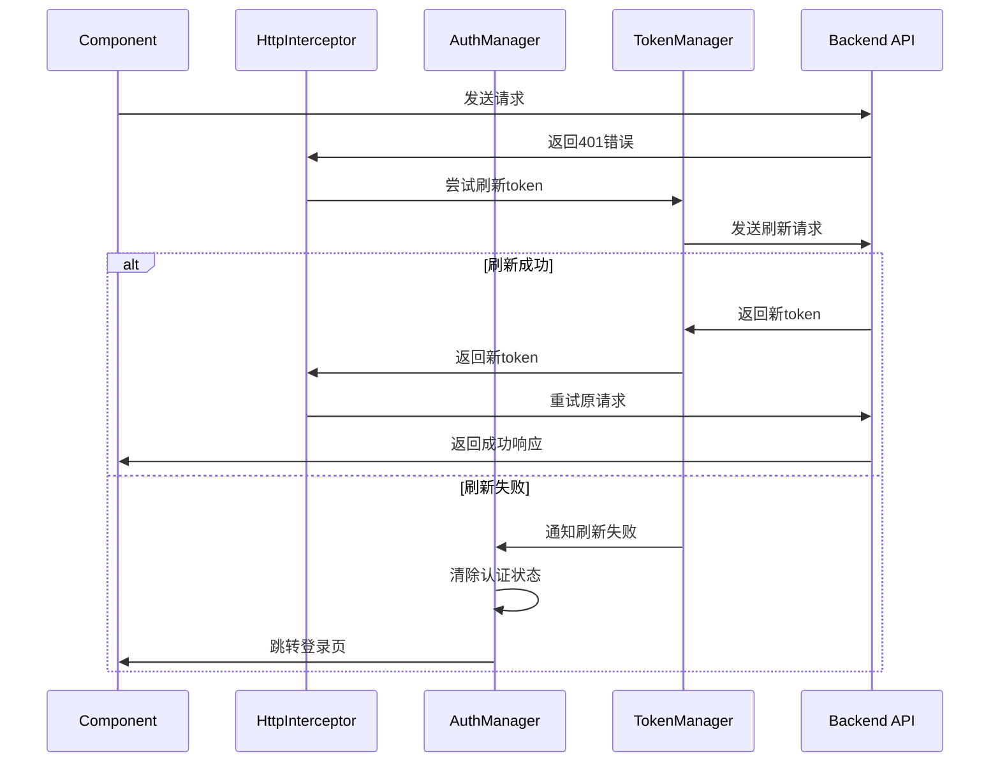

# 认证系统架构文档

## 概述

本项目采用了分层的认证系统架构，提供了完整的用户认证、token管理、会话监控和安全防护功能。

## 架构组件

### 1. 核心组件

#### AuthManager (认证管理器)
- **位置**: `src/utils/auth/authManager.ts`
- **职责**: 统一管理认证状态、用户信息、会话监控
- **特性**:
  - 单例模式，全局唯一实例
  - 自动初始化和状态恢复
  - 事件驱动的状态更新
  - 多标签页状态同步

#### TokenManager (Token管理器)
- **位置**: `src/utils/auth/tokenManager.ts`
- **职责**: 专门处理JWT token的存储、验证、刷新
- **特性**:
  - 防并发刷新机制
  - 频率限制保护
  - 自动过期检测
  - 安全存储管理

#### SecurityUtils (安全工具)
- **位置**: `src/utils/auth/security.ts`
- **职责**: 提供安全相关的工具函数和配置
- **特性**:
  - 密码强度验证
  - 会话超时监控
  - 数据混淆/解混淆
  - XSS防护

### 2. 配置管理

#### 统一配置
- **位置**: `src/config/auth.config.ts`
- **内容**:
  - Token配置 (刷新阈值、有效期等)
  - 会话配置 (超时时间、警告时间等)
  - HTTP配置 (超时、重试等)
  - 安全配置 (密码策略等)
  - 日志配置 (详细程度、事件记录等)

### 3. HTTP拦截器

#### 请求拦截器
- 自动添加认证头
- 活动时间更新
- 安全头注入
- Token自动刷新

#### 响应拦截器
- 统一错误处理
- 新Token自动更新
- 401错误自动重试
- 网络错误处理

### 4. 路由守卫

#### 认证检查
- 自动初始化认证管理器
- 路由权限验证
- 已登录用户重定向
- 详细的日志记录

### 5. Vue Composable

#### useAuth
- **位置**: `src/composables/useAuth.ts`
- **功能**:
  - 响应式认证状态
  - 登录/登出操作
  - Token刷新
  - 权限检查
  - 事件监听

## 工作流程

### 1. 用户登录流程



### 2. Token自动刷新流程



### 3. 401错误处理流程



## 安全特性

### 1. Token安全
- JWT格式验证
- 过期时间检查
- 自动刷新机制
- 频率限制保护
- 并发刷新防护

### 2. 会话安全
- 活动时间监控
- 自动超时登出
- 多标签页同步
- 页面可见性检测

### 3. 存储安全
- 敏感数据混淆
- 完整性校验
- 自动清理机制

### 4. 网络安全
- 请求头安全验证
- XSS防护
- CSRF保护
- 安全URL检查

## 配置说明

### Token配置
```typescript
TOKEN: {
  REFRESH_THRESHOLD: 5 * 60 * 1000,    // 提前5分钟刷新
  AUTO_REFRESH_INTERVAL: 2 * 60 * 1000, // 每2分钟检查
  MAX_VALIDITY: 24 * 60 * 60 * 1000,   // 最大24小时有效
  REFRESH_RATE_LIMIT: 30 * 1000,       // 30秒刷新限制
  MAX_REFRESH_ATTEMPTS: 3,              // 最多重试3次
}
```

### 会话配置
```typescript
SESSION: {
  TIMEOUT: 30 * 60 * 1000,      // 30分钟超时
  WARNING_TIME: 25 * 60 * 1000, // 25分钟警告
  CHECK_INTERVAL: 60 * 1000,    // 每分钟检查
}
```

## 使用示例

### 在组件中使用认证
```vue
<template>
  <div v-if="isAuthenticated">
    <h1>欢迎, {{ userName }}!</h1>
    <button @click="logout">登出</button>
  </div>
  <div v-else>
    <p>请先登录</p>
  </div>
</template>

<script setup>
import { useAuth } from '@/composables/useAuth'

const {
  isAuthenticated,
  userName,
  logout,
  authError
} = useAuth()
</script>
```

### 手动检查认证状态
```typescript
import { authManager } from '@/utils/auth/authManager'

// 检查是否已认证
if (authManager.isAuthenticated()) {
  // 执行需要认证的操作
}

// 获取认证摘要
const summary = authManager.getAuthSummary()
console.log('认证状态:', summary)
```

### 监听认证事件
```typescript
import { SecurityEventListener, SECURITY_EVENTS } from '@/utils/auth/security'

// 监听token刷新事件
SecurityEventListener.addEventListener(SECURITY_EVENTS.TOKEN_REFRESHED, () => {
  console.log('Token已刷新')
})

// 监听会话警告
SecurityEventListener.addEventListener(SECURITY_EVENTS.SESSION_WARNING, () => {
  // 显示会话即将过期的提示
})
```

## 最佳实践

### 1. 组件中的认证检查
- 使用 `useAuth` composable 获取响应式状态
- 避免直接调用 `authManager` 的方法
- 利用计算属性进行权限判断

### 2. API请求
- 所有API请求自动包含认证头
- 无需手动处理401错误
- 信任HTTP拦截器的自动重试机制

### 3. 错误处理
- 监听认证事件进行UI更新
- 使用统一的错误提示机制
- 记录详细的错误日志

### 4. 性能优化
- 避免频繁的认证状态检查
- 使用事件驱动更新UI
- 合理配置刷新间隔

## 故障排除

### 常见问题

1. **Token刷新失败**
   - 检查网络连接
   - 验证refresh token是否有效
   - 查看刷新频率是否过高

2. **会话意外过期**
   - 检查用户活动监测
   - 验证会话超时配置
   - 查看多标签页同步状态

3. **认证状态不同步**
   - 确认事件监听器正常工作
   - 检查localStorage访问权限
   - 验证组件生命周期

### 调试工具

1. **启用详细日志**
   ```typescript
   // 在 auth.config.ts 中设置
   LOGGING: {
     ENABLE_VERBOSE: true,
     LOG_AUTH_EVENTS: true,
     LOG_TOKEN_OPERATIONS: true,
   }
   ```

2. **获取认证摘要**
   ```typescript
   console.log(authManager.getAuthSummary())
   ```

3. **监听所有认证事件**
   ```typescript
   Object.values(SECURITY_EVENTS).forEach(event => {
     SecurityEventListener.addEventListener(event, (data) => {
       console.log(`事件: ${event}`, data)
     })
   })
   ```

## 更新日志

### v2.0.0 (当前版本)
- 重构认证架构，引入AuthManager
- 优化Token管理机制
- 统一配置管理
- 增强安全防护
- 改进错误处理
- 添加Vue Composable支持

### v1.0.0 (原版本)
- 基础Token管理
- 简单的HTTP拦截器
- 基本的路由守卫